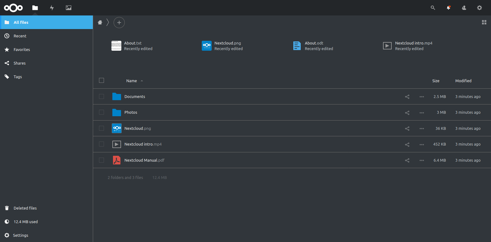

# Breeze Dark Theme
This is a Breeze Dark Theme for [Nextcloud](https://nextcloud.com) based on the Breeze Dark theme made by the KDE Project.



## Version number
The first number is the Nextcloud version. The second number is the Nextcloud major point release version. The third number is the theme version.

## Installation
It's available in the [nextcloud app store](https://apps.nextcloud.com/apps/breezedark), just search for Breeze Dark, or look under customizations.

or you can clone this repo into your app folder and enable it in the app menu in Nextcloud.

## Usage
After you install the theme, you need to enable it. There a 2 options for this, a global and a personal one.

#### Global
The global option enables the theme by default for all users and unauthenticated visits. Without this options stuff like the login and sharing pages won't be styled. You can find there global option here:
```
Admin settings > Theming > Breeze Dark
```
#### Personal
The personal option allows each user to set their own preference independent of how you set the global option. If the user hasn't set an option yet, they will follow the global option. You can find the personal option here:
```
Personal settings > Accessibility > Breeze Dark
```
## Contributions

### Issues
If you find an issue with the theme I would grealy appreciate it if you opened a bug report, so it can be fixed.

You're also very welcome to open a styling request, if there is an app you would like to see supported by this theme.

A full list of supported apps can be found on the [wiki](https://github.com/mwalbeck/nextcloud-breeze-dark/wiki/Styled-apps).

### Pull requests
If you would like to contribute to the theme, all you need is a working Nextcloud setup and a text editor. Nextcloud is going to handle all the sass compilation on it's own. When you have you have Nextcloud setup, you can simply clone this repo into the app folder.

As nextcloud caches all sass, your changes won't show up immediately. To have your changes show up an easy trick is to disable the theme, refresh the page and then enable it again. This isn't perfect, but works most of time. If your changes don't show up, you can either wait a couple of minutes and then try again, or you can try running an **occ maintenance:repair**.

You're always welcome to open an issue and talk about the changes, you would like to make, before starting.

## Donations
If you like the theme and would like to donate you can use the following ways:

**Liberapay:**  
https://liberapay.com/mwalbeck/

**PayPal:**  
https://www.paypal.me/magnuswalbeck

**Crypto:**  
BTC: 1Pp3UG9k6ZkwrVXrhr9kwwvjwDk5Vchu3f  
BCH: 1C7dQLqMU6Kucxx9GcFDMnTTTsBpeNT9vo  
LTC: LLii6QbQiHnkjq2TNcNYC3JafV4mWYXWnx

Thank you!
