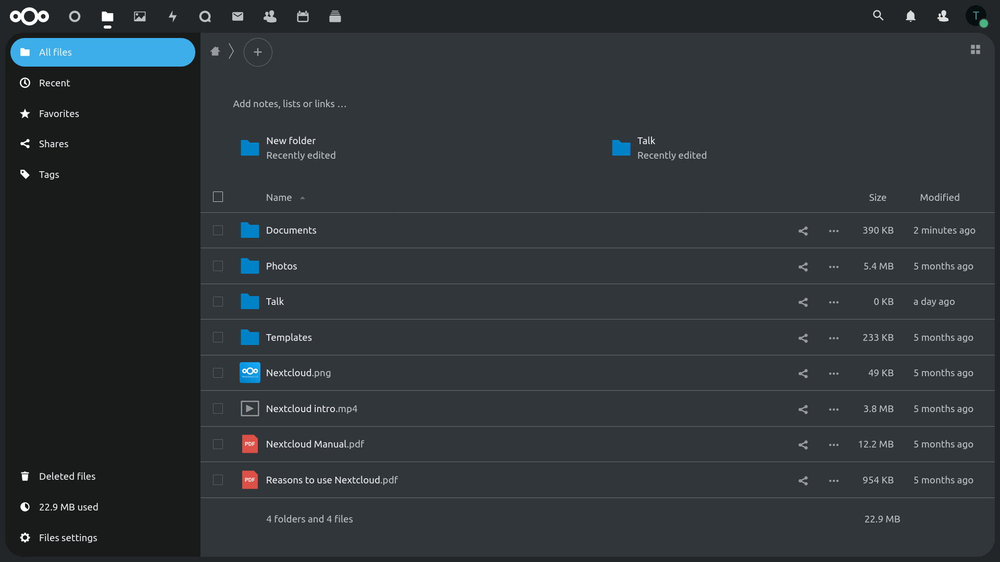

# Breeze Dark Theme
This is a Breeze Dark Theme for [Nextcloud](https://nextcloud.com) based on the Breeze Dark theme made by the KDE Project.

## Version number
The first number is the Nextcloud version. The second number is the Nextcloud major point release version. The third number is the theme version.

## Installation

Go to the Nextcloud app store and search for Breeze Dark.

or you can clone this repo into your app folder and enalbe it in the app menu in Nextcloud.

## Contributions
You need no special tools to contribute to this theme. It's uses Nextcloud for everything include sass compilation. You can just clone the theme into app folder, enable it and get started.

As nextcloud caches all sass your changes won't show up immediately. To force nextcloud to recompile it and easy trick is to disable the theme, refresh the page and then enable it again.

You're always welcome to open an issue and talk about the changes, you would like to make, before starting.

Please make all contributions to the develop branch.

## Donations
If you like the theme and would like to donate you can use the following ways:

**PayPal:**  
https://www.paypal.me/magnuswalbeck

**Crypto:**  
BTC: 1Pp3UG9k6ZkwrVXrhr9kwwvjwDk5Vchu3f  
BCH: 1C7dQLqMU6Kucxx9GcFDMnTTTsBpeNT9vo  
LTC: LLii6QbQiHnkjq2TNcNYC3JafV4mWYXWnx

Thank you.